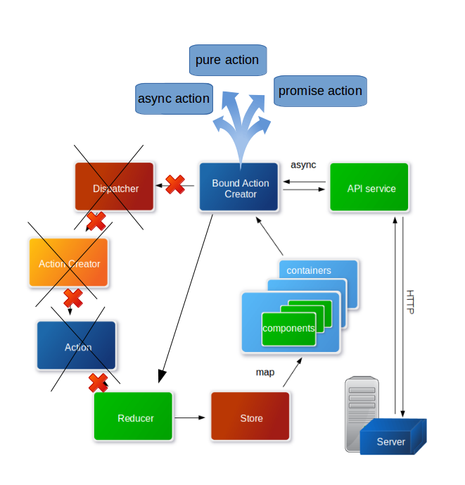

## Application dispatcher (Service/Helper for Redux Infrastructure)
[](https://www.npmjs.com/package/redux-acb)

### Image:



### Interface
This module provide following interface:
```
createAction
boundAction
boundPromise
boundAsync
```

### Async Example:
```javascript
import { buildDispatcher } from 'redux-acb';
import store from './store';

const { boundPromise } = buildDispatcher(store);

/**
 * Bound login action creators
 *
 * @param {String} username - User name
 * @param {String} password - User password
 *
 * @returns {Function} Binder
*/
export function boundLogin(username, password) {
  return boundPromise(
    login,
    'LOGIN',
    (state) => state.Auth.loading,
    [username, password]
  );
}

/**
 * Bound logout action creators
 *
 * @returns {Function} Binder
 */
export function boundLogout() {
  return boundPromise(
    logout,
    'LOGOUT',
    (state) => state.Auth.loading
  );
}
```

### Pure Example:
```javascript
import { buildDispatcher } from 'redux-acb';
import store from './store';

const { boundAction } = buildDispatcher(store);
/**
 * Bound project information modal toggle action creator
 *
 * @returns {Function} Binder
 */
export function boundToggleProjectInformationModal() {
  return boundAction('TOGGLE_PROJECT_INFORMATION_MODAL');
}
```

### Reducer
```javascript

...

export function authReducer(state = initialState, action) {
  switch (action.type) {
    // ********************* LOGIN ******************************
    case 'LOGIN_PENDING':
        // TODO return new state
    case 'LOGIN_SUCCESS':
        // TODO return new state
    case 'LOGIN_FAIL':
        // TODO return new state
    case 'LOGOUT_PENDING':
      // TODO return new state
    case 'LOGOUT_SUCCESS':
      // TODO return new state
    case 'LOGOUT_FAIL':
      // TODO return new state
    default:
      return state;
  }
}

...

```